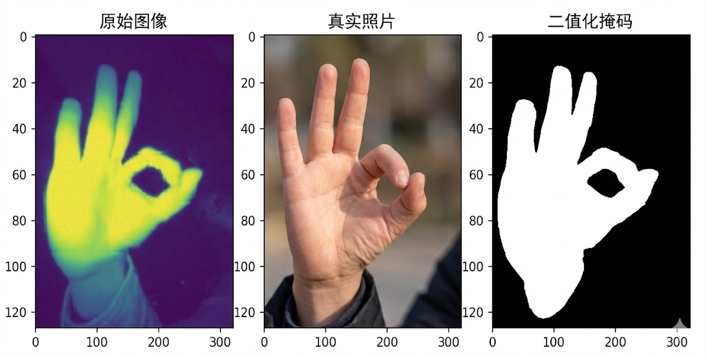

# GestureRecognition-ESP32S3

This project runs gesture recognition on images captured by an ESP32-S3 camera using an ONNX model. The repo includes both firmware and a local inference script.

## Repository layout
```
project/
  models/
    mobile10.onnx             # ONNX model file
    idx_to_labels.npy         # class index to label map (provide your own)
  python/
    onnx_pred_s.py            # single image inference
    requirements.txt          # Python deps
  main/                       # ESP32-S3 firmware (Wi-Fi + upload)
    station_upload.c
    CMakeLists.txt
    component.mk
  CMakeLists.txt
  Makefile
  sdkconfig
```

## High-level flow
1. ESP32-S3 camera captures a frame and uploads an image.
2. Save the image locally (for example, `pic.png`).
3. Run `python/onnx_pred_s.py` to get Top-K predictions and FPS.

## Python setup
```
python -m venv .venv
source .venv/bin/activate
pip install -r python/requirements.txt
```

## Run inference
```
python python/onnx_pred_s.py \
  --image pic.png \
  --model models/mobile10.onnx \
  --labels models/idx_to_labels.npy \
  --topk 3
```

### Arguments
- `--image`: image path (default `pic.png`)
- `--model`: ONNX model path (default `models/mobile10.onnx`)
- `--labels`: label map file (`.npy`, optional; default `models/idx_to_labels.npy`)
- `--topk`: number of top results to show (default 3)

## Label file format
`idx_to_labels.npy` should contain an object that can be converted to `dict`, for example:
```
import numpy as np
idx_to_labels = {0: "A", 1: "B", 2: "C"}
np.save("idx_to_labels.npy", idx_to_labels)
```

## Preprocessing and output
The script applies:
- `Resize(224)` + `CenterCrop(224)`
- `ToTensor()`
- Normalize with `mean=[0.0979]*3`, `std=[0.1986]*3`

The output includes:
- Top-K class names and confidence scores
- Single-image FPS (rough reference)

## Firmware notes (ESP32-S3)
Firmware lives in `main/station_upload.c` and starts Wi-Fi, runs a web server, and uploads images.
Build and flash using your existing ESP-IDF workflow (`idf.py` or `make`, depending on your setup).

## Troubleshooting
- `Image not found`: check the `--image` path.
- `Model not found`: check the `--model` path.
- Missing labels file: results will show `Unknown`; add `idx_to_labels.npy`.
